

Waste to Worth is a non-profit Android application developed to reduce waste and help people in need by connecting donors with underprivileged individuals and organizations. In India, many usable items like food, clothes, and books are thrown away every day while millions lack access to these essentials. This app provides a simple, real-time, and location-based platform where users can donate or receive items easily. **Built using Android Studio with Java and XML**, it offers secure login, an easy-to-use interface, and map integration to find nearby donors, receivers, and volunteers.

The app includes features such as donating and receiving items, viewing locations on a live map, tracking donations through history and pins, and volunteering to support the donation process. An AI-based food freshness scanner helps ensure that only safe and usable food is shared. Waste to Worth focuses on sustainability, social responsibility, and community empowerment, aiming to create long-term environmental and social impact by redistributing resources more fairly.

Architecture Diagram : 

  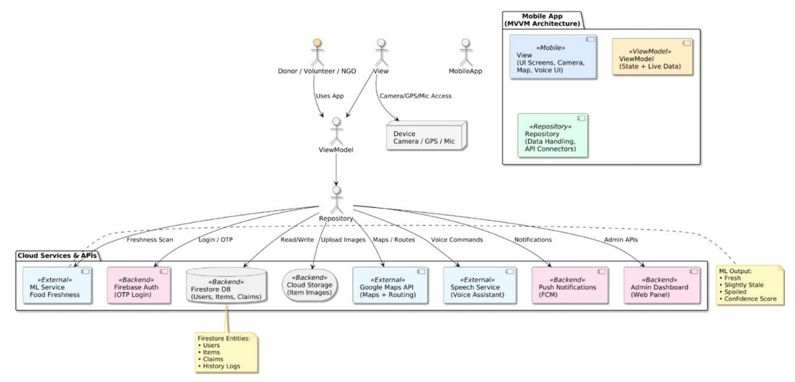

Screenshots of the Android App :

<table>
  <tr>
    <th>Splash</th>
    <th>Role Login</th>
    <th>User Register</th>
    <th>User Login</th>
  </tr>
  <tr>
    <td>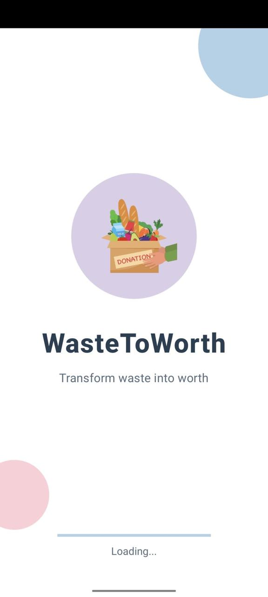</td>
    <td>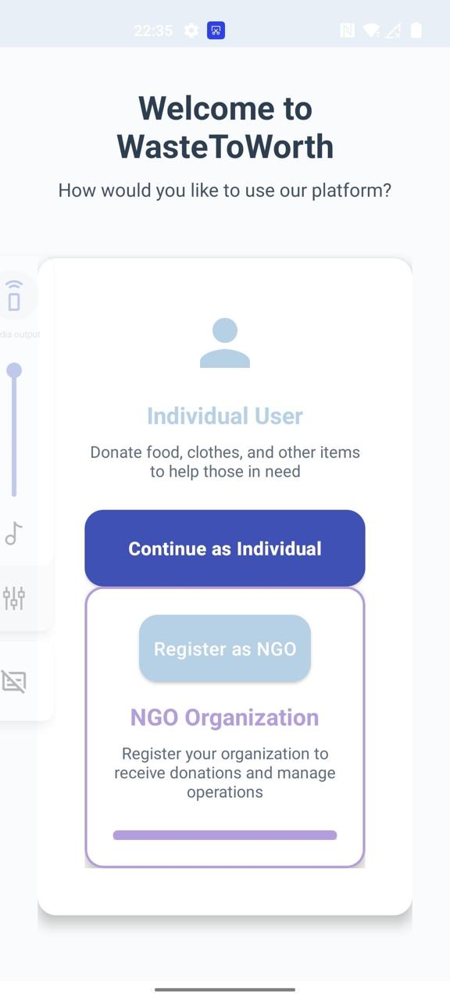</td>
    <td>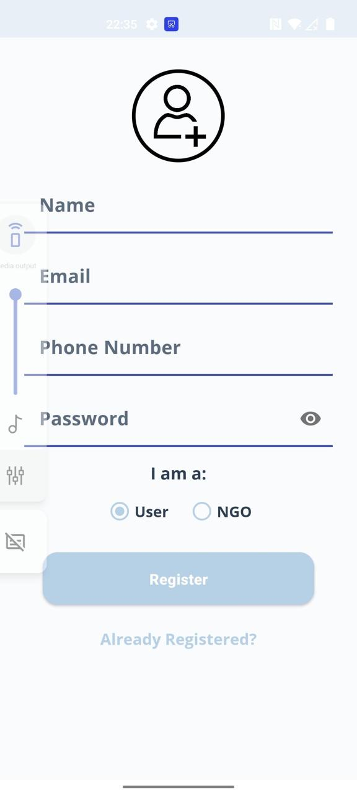</td>
    <td>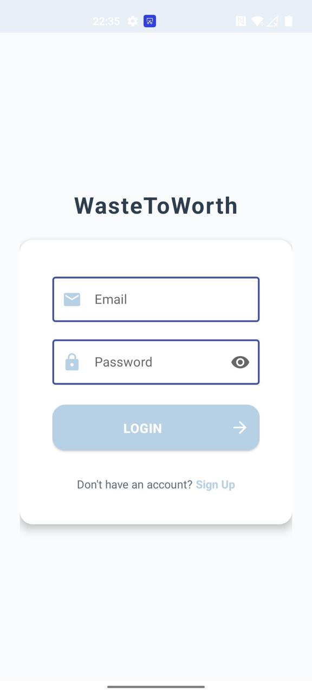</td>
  </tr>
</table>

 

<table>
  <tr>
    <th>Home 1</th>
    <th>Home 2</th>
    <th>Donate</th>
    <th>Receive</th>
    <th>Food Map</th>
  </tr>
  <tr>
    <td>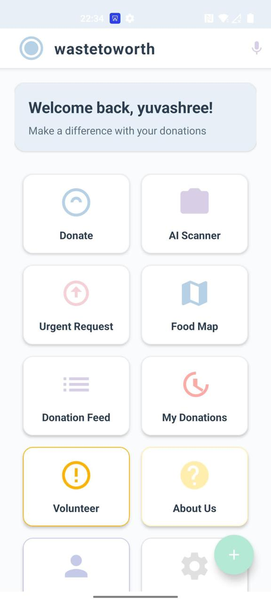</td>
    <td>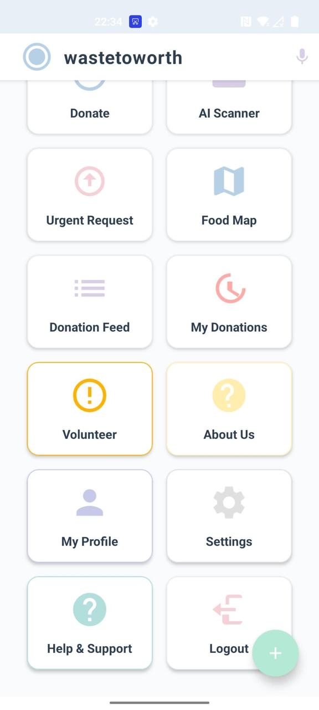</td>
    <td>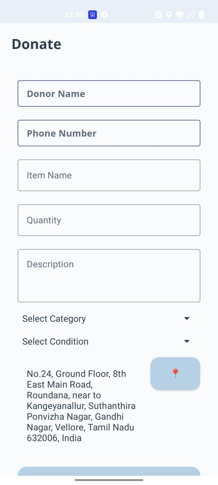</td>
    <td>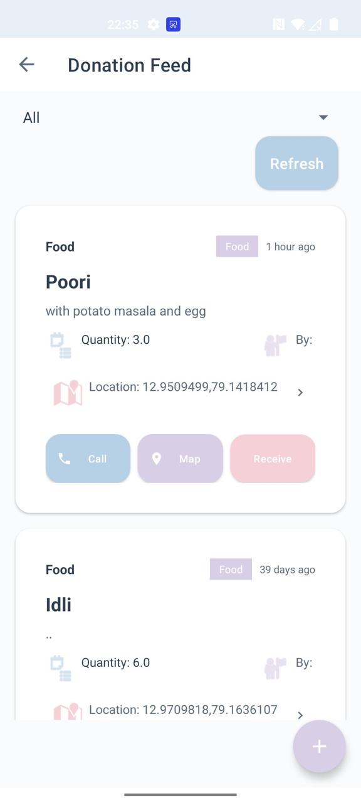</td>
    <td>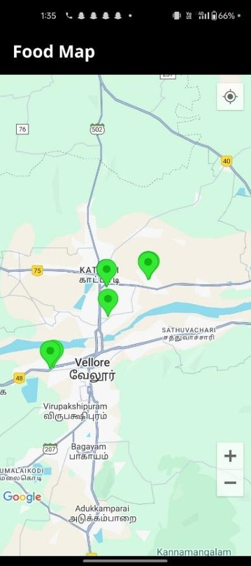</td>
  </tr>
</table>

 

<table>
  <tr>
    <th>AI Food Scanner</th>
    <th>Urgent Request</th>
    <th>Donation History</th>
    <th>Volunteer</th>
  </tr>
  <tr>
    <td>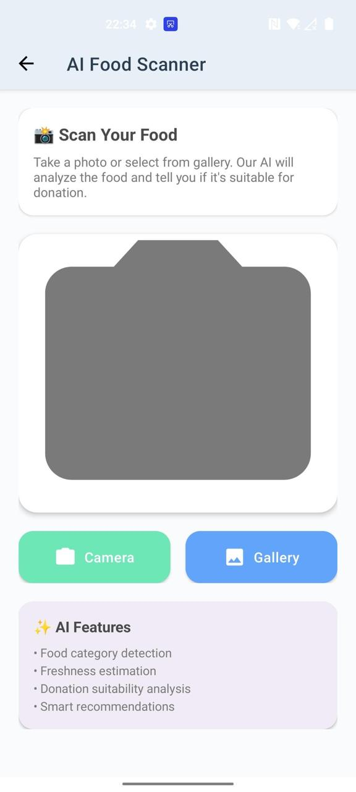</td>
    <td>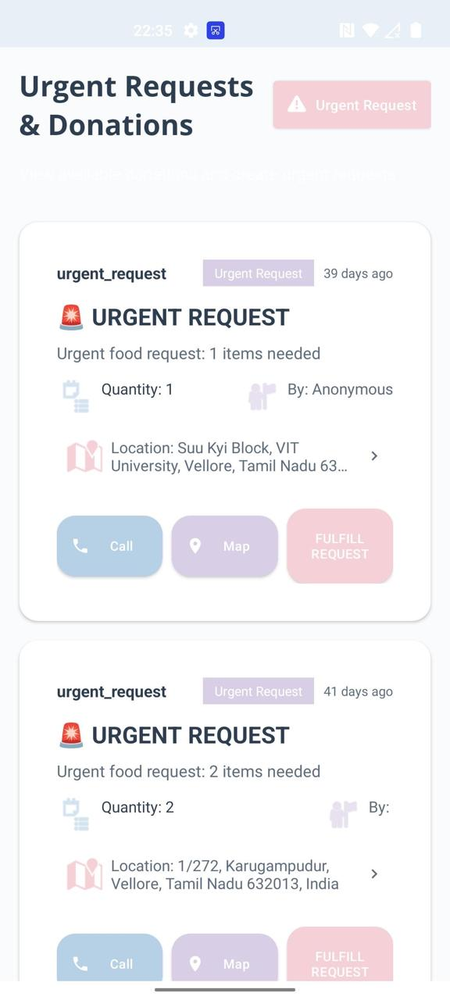</td>
    <td>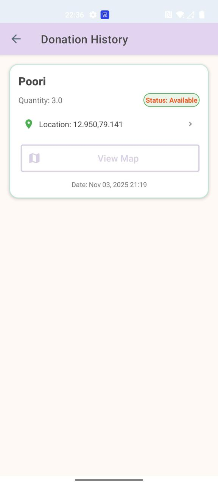</td>
    <td>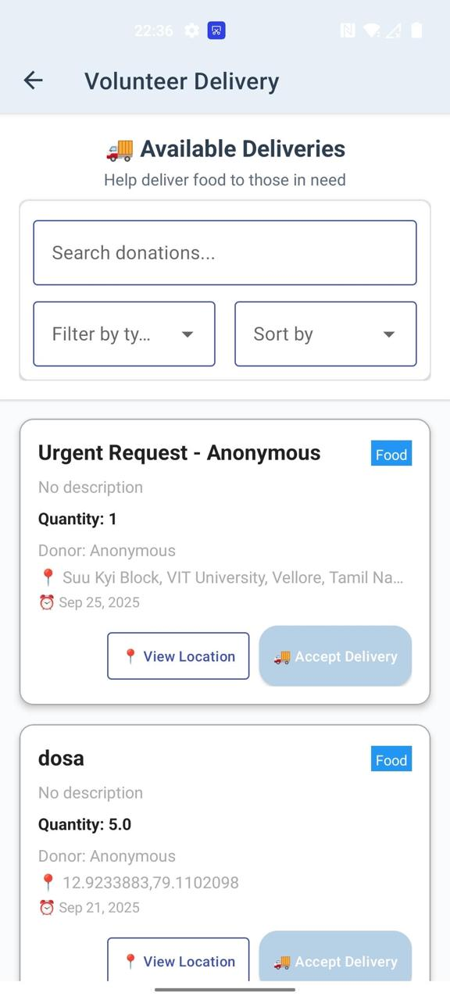</td>
  </tr>
</table>

 

<table>
  <tr>
    <th>Profile</th>
    <th>Settings</th>
    <th>About</th>
    <th>Help</th>
  </tr>
  <tr>
    <td>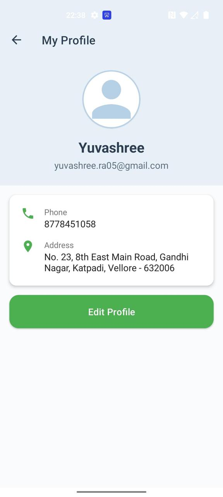</td>
    <td>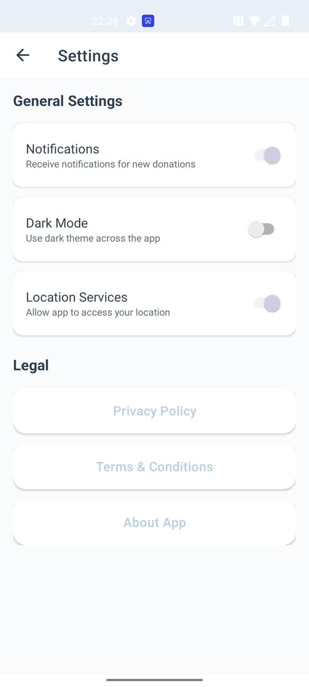</td>
    <td>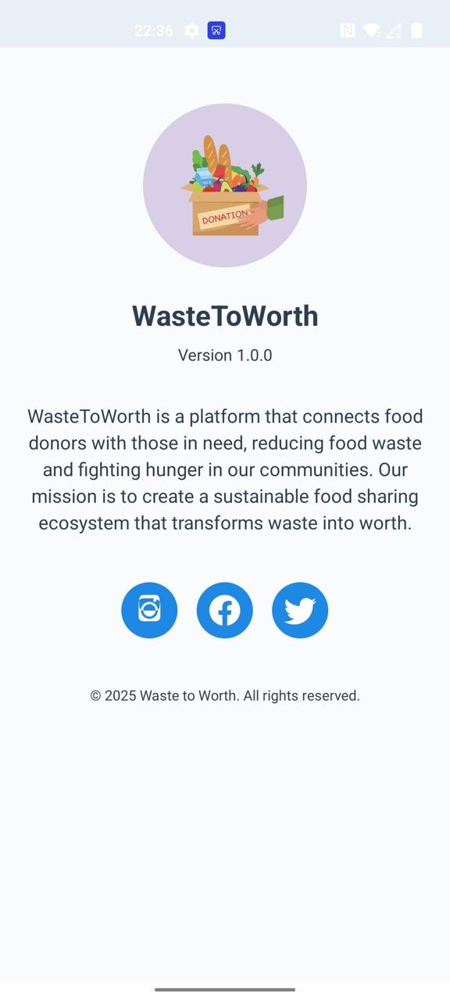</td>
    <td>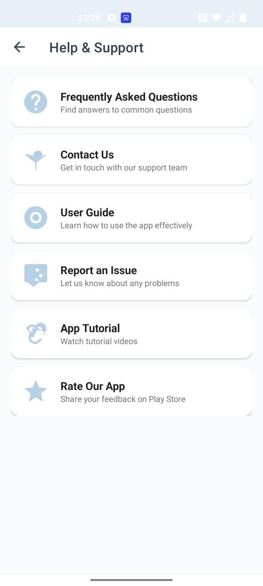</td>
  </tr>
</table>

 

<table>
  <tr>
    <th>NGO Register</th>
  </tr>
  <tr>
    <td>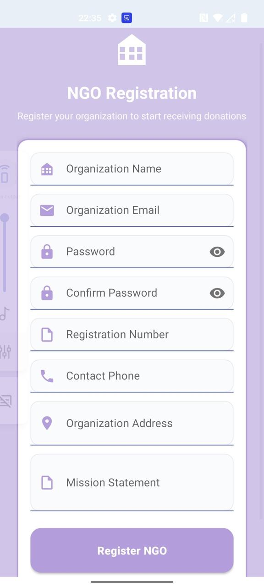</td>
  </tr>
</table>

=======
# Waste-to-Worth-Android-App-
Waste to Worth is an Android app that helps people donate unused food, clothes, and books to those in need. It uses a simple, location-based system to connect donors and receivers in real time. The app aims to reduce waste and support communities in a non-commercial way. Users can also volunteer to help manage and deliver donations efficiently.
>>>>>>> edad67f32f8225856b3ca28e9190ac11063c7889
